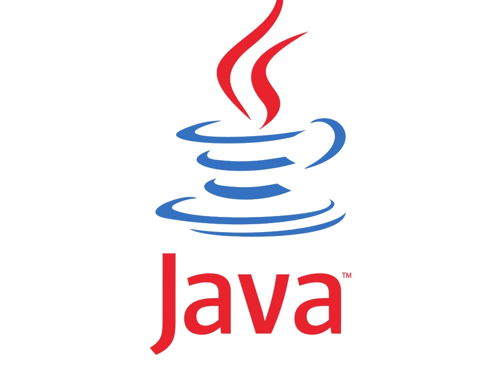

Groovyの話


---

## JavaでHelloWorld

```:HelloWorld.java
public class HelloWorld
{
  public static void main(String[] args) {
    System.out.println("Hello Java World.");
  }
}
```
```
$ javac HelloWorld.java
$ java HelloWorld
Hello Java World.
```
---

## Groovyについて
* Groovy（グルービー）は、Javaプラットフォーム(JVM)上で動作する動的プログラミング言語である。
* GroovyからすべてのJava SE APIや、Javaで書かれた任意のサードパーティ製のコンパイル済みのライブラリなどを呼び出すことができる。
* Groovyの言語仕様はJavaのそれをベースとしているが、スクリプト言語として大幅に簡易化された記述を許している。

(Wikipediaより)

---


---
## GroovyでHelloWorld

```:HelloWorld.groovy
public class HelloWorld
{
  public static void main(String[] args) {
    System.out.println("Hello Groovy World.");
  }
}
```
```
$ groovyc HelloWorld.groovy
$ groovy HelloWorld
Hello Groovy World.
```
------
## GroovyでHelloWorld

```:HelloWorld.groovy
println "Hello Groovy World."
```
```
$ groovy HelloWorld.groovy
Hello Groovy World.
```

---

## GroovyでHelloWorld

ワンライナーでもOK

```
$ groovy -e 'println "Hello Groovy World.";'
Hello Groovy World.
```

---


---

## PHPでHelloWorld

```:HelloWorld.php
<?php
print "Hello PHP World.¥n";
```
```
$ php HelloWorld.php
Hello PHP World.
```
```
$ php -r 'print "Hello PHP World.¥n";'
Hello PHP World.
```
---

## Javaと比較したGroovyの特徴
* 変数の型宣言は不要。
* メソッド呼び出しの括弧、行末のセミコロンは省略できる。
* リストやマップの初期化を記述する組み込み構文を持つ。
* アクセス修飾子のデフォルトはpublic。
* java.lang、java.io、java.math、java.net、java.util、groovy.lang、groovy.utilは明示的に指定しなくても、暗黙的にインポートされている。

---

## 関連
* Spock
  * Groovyで書けるユニットテストフレームワーク

* Grails
  * ruby on rails的なフレームワーク

* Gradle
  * Makefile や Ant、 Maven のようなビルドシステム

---

## Groovyの歴史
James Strachan と Bob McWhirter らを中心に、オープンソース開発サイトであるコードハウス上で、2003年8月27日に開発が開始された。
その後、開発の主体は Guillaume Laforge と Jeremy Rayner らに移り開発が続けられている。
2015年3月31日までは Pivotal がスポンサー企業となり、開発者をフルタイム雇用していたが、3月末を持って終了し、Apacheソフトウェア財団の管理に移行した。
